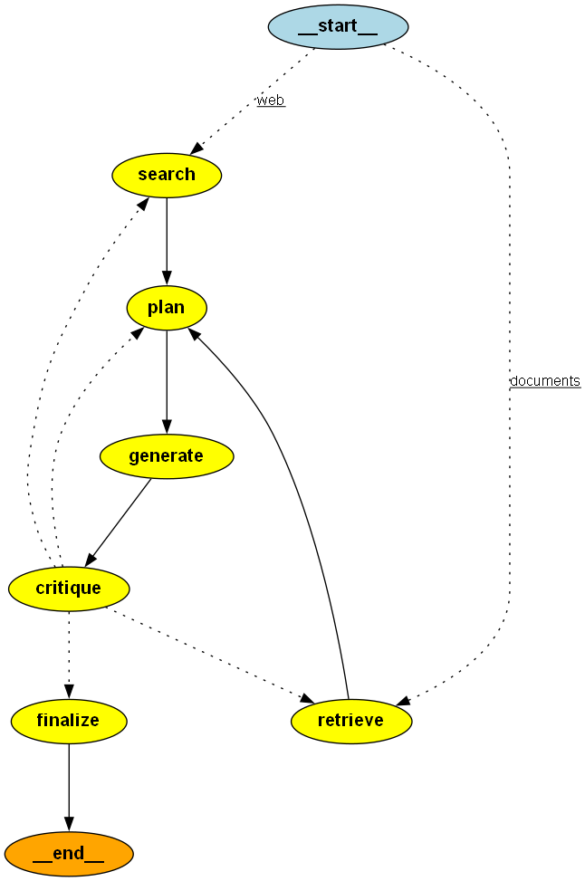

# Learning Path Generator

An AI agent that generates a personalized, week-by-week learning path for any topic, and iteratively critiques and refines its own output before presenting it to the user. Built with [LangGraph](https://github.com/langchain-ai/langgraph) to explore stateful, cyclical agent orchestration (as opposed to a simple one-shot LLM call).

A second implementation of the same system, built in [CrewAI](https://github.com/crewAIInc/crewAI), lives alongside this one as a framework comparison exercise — see [Framework Comparison](#framework-comparison-langgraph-vs-crewai) below, and [COMPARISON.md](./COMPARISON.md) for the full write-up.

## What it does

Given a **topic**, a **time budget** (in weeks), a **level** (beginner / intermediate / expert), and a **goal** (e.g. job hunting, general learning), the system:

1. **Searches** the web for real, current learning resources on the topic
2. **Plans** a week-by-week sequence of those resources, respecting the time budget and level
3. **Generates** a polished, human-readable write-up of the plan
4. **Critiques** its own output against the original constraints, and either:
   - **Approves** it and finalizes, or
   - **Sends it back to re-plan** (if pacing/sequencing is the problem), or
   - **Sends it back to re-search** (if the resources themselves are inadequate)

This loop repeats (capped at a max iteration count) until the plan is genuinely good, or the cap is hit — in which case the final output is still returned, with a disclaimer noting it may need manual review.

## Architecture



```
START → (mode routing)
              ├─ "web"       → search    ─┐
              └─ "documents" → retrieve  ─┴→ plan → generate → critique → (conditional routing)
                                                          ↑           ↑           ├─ approve → finalize → END
                                                          └───────────┴── replan ─┤
                                                          └── research (routes back to search OR retrieve, matching original mode) ┤
                                                                                  └─ max iterations → finalize → END
```

Built as a `StateGraph` with 6 nodes (`search`, `retrieve`, `plan`, `generate`, `critique`, `finalize`), a conditional entry point that routes to `search` (web) or `retrieve` (user documents) based on the requested `mode`, and a conditional edge after `critique` that routes based on the verdict — including routing `"research"` back to whichever resource-gathering node matches the original mode.

**Two resource-gathering modes:**
- **`web`** — searches the live web via Tavily (LangGraph) or Serper (CrewAI)
- **`documents`** — retrieves from the user's own uploaded documents via a local RAG pipeline: documents are chunked (`RecursiveCharacterTextSplitter`), embedded with a local, free HuggingFace model (`all-MiniLM-L6-v2`, no API key needed), stored in a Chroma vector store, and the most relevant chunks are retrieved via similarity search against the topic.

Both modes produce the same `SearchResult` structure, so `plan`, `generate`, and `critique` are entirely unaware of which mode produced their input — the RAG mode was added with zero changes to the downstream loop.

## Setup

**1. Clone the repo and install dependencies**
```bash
git clone https://github.com/Parul671992/Learning-path-generator.git
cd Learning-path-generator
pip install -r requirements.txt
```

**2. Get free API keys**

Both notebooks call out to an LLM and a web search tool — you'll need a key for each:

| Key | Used by | Get it at |
|---|---|---|
| `GROQ_API_KEY` | Both notebooks (LLM inference) | console.groq.com — no credit card required |
| `TAVILY_API_KEY` | LangGraph notebook's search tool | tavily.com |
| `SERPER_API_KEY` | CrewAI notebook's search tool | serper.dev |

**3. Create a `.env` file in the project root**
```
GROQ_API_KEY=your_groq_key_here
TAVILY_API_KEY=your_tavily_key_here
SERPER_API_KEY=your_serper_key_here
```
(`.env` is gitignored — never commit real API keys.)

**4. Run the notebooks**

- `learning_path_generator.ipynb` — the LangGraph version
- `learning_path_generator_crewai.ipynb` — the CrewAI version

Each is self-contained; open either in Jupyter and run all cells top to bottom. Neither depends on the other having been run first.

**5. (Optional) Try the RAG / "documents" mode**

To generate a learning path grounded in your own documents instead of the web, set `mode: "documents"` in the initial state and point `docs_folder` at a folder of your own `.txt`, `.md`, or `.pdf` files (a couple of sample files are included in `my_documents/` to try it out immediately). No extra API key is needed — embeddings run locally.

## Design decisions & lessons learned

A few deliberate choices worth calling out — and what I learned building this:

- **Temperature varies by node role.** `plan` and `critique` use `temperature=0` (deterministic, evaluative tasks); `generate` uses `temperature=0.7` (creative, user-facing writing). One LLM config for every node would have been simpler but worse — matching temperature to the node's job produces more reliable structured output where it matters and more natural prose where it doesn't.

- **Structured output (Pydantic schemas) for anything a downstream node consumes; free text for anything a human reads.** `search` and `plan` both use `.with_structured_output()` so their results are type-safe and machine-parseable. `generate`'s output is deliberately free text, since it's the final human-facing artifact.

- **Critique calibration was the hardest part of this project, and the most instructive.** My first version of the critique prompt said "be critical, not lenient" with no defined bar for "good enough" — this caused the critique agent to *never* approve a plan, hitting the max-iteration cap on every run. The fix was adding explicit approval criteria ("approve unless there's a genuine, significant mismatch — minor imperfections are expected"). This is a real, generalizable lesson: **vague qualifiers given to an LLM produce inconsistent behavior; explicit, bounded instructions produce reliable behavior.** The same fix pattern applied to `generate`'s tone (a soft "use emojis sparingly" instruction was replaced with a hard "do not use emojis" instruction, which was followed consistently). Iteration counts across debugging: 5/5 (never converged) → 3/3 (still capping) → 2/3 (genuine replan then approve, converges naturally).

- **Search results replace rather than append on a re-search loop.** When critique routes back to `search` with feedback about poor resource quality, the new search results replace the old ones entirely rather than merging. This is a simplifying v1 assumption — a v2 could compare old vs. new and keep the better ones.

- **A retry wrapper around structured-output calls.** LLM outputs are probabilistic — even with a tight schema, a call can occasionally fail validation (e.g., the model returning a list where a string was expected). Rather than fixing this at the prompt level alone, I added a small retry wrapper (`invoke_with_retry`) with logging, so occasional validation failures self-heal instead of crashing the whole run. This is standard practice for any system built on non-deterministic model output.

- **Checkpointing (LangGraph's `SqliteSaver`).** The graph is compiled with a checkpointer, so state is saved after every node execution, keyed by a `thread_id`. This isn't just plumbing — it's what would enable resuming a long-running plan generation, inspecting intermediate state, or building a human-in-the-loop review step later.

- **RAG mode reuses the existing resource structure rather than introducing a parallel data path.** Retrieved document chunks are mapped into the same `SearchResult` schema that web search results use (with `resource_type="user_document"` to distinguish them), so `plan`, `generate`, and `critique` needed zero changes to support the new mode — the only new code is the `retrieve` node itself and the mode-based routing at the graph's entry point and after `critique`.

- **A routing bug specific to adding the second mode**: the conditional edge after `critique` originally hardcoded a `"research"` verdict to always route back to the web `search` node, regardless of which mode the run started in. This silently switched a "documents" mode run back to web search mid-run whenever critique asked for better resources — the fix makes that route conditional on the original `mode`. A good reminder that adding a second path through a graph means re-checking every existing conditional edge, not just adding new nodes.

- **Retrieval working correctly isn't enough — the downstream prompt needs to forbid inventing resources.** Even with retrieval correctly grounded in the user's documents, `plan`'s first version still hallucinated generic, familiar-sounding web courses instead of using the retrieved content, because nothing told it not to. Adding an explicit instruction ("only use the resources provided below, do not invent others") fixed this completely — another instance of the same "explicit instructions, not vague ones" lesson from the critique-calibration issue.

For the CrewAI-specific lessons (including five real framework bugs found and fixed), see [COMPARISON.md](./COMPARISON.md).

## Known limitations (v1)

- `resource_type` on search results is left as `"unknown"` — classifying it properly would need an extra LLM call per search, which I skipped for cost/latency reasons given search can run multiple times per session.
- Checkpointing currently uses in-memory SQLite (`:memory:`), so state doesn't persist across kernel restarts. Switching to a file-based DB is a one-line change if cross-session persistence is needed.
- Single LLM provider (Groq). No fallback if Groq's API is unavailable.
- No human-in-the-loop step yet — the critique loop is fully autonomous. A natural v2 addition, enabled by the checkpointing already in place.
- Search result count is fixed at 5 regardless of the time budget requested — kept fixed intentionally to keep the LangGraph and CrewAI versions a fair, like-for-like comparison.

## Tech stack

- **LangGraph** — stateful agent orchestration (LangGraph notebook)
- **CrewAI** — role-based agent orchestration (CrewAI notebook)
- **Groq** (`openai/gpt-oss-120b`) — LLM inference, free tier, used by both notebooks
- **Tavily** — web search (LangGraph notebook)
- **Serper** — web search (CrewAI notebook)
- **Chroma** — local vector store for RAG / "documents" mode (LangGraph notebook)
- **HuggingFace `sentence-transformers` (`all-MiniLM-L6-v2`)** — local embeddings, no API key needed
- **Pydantic** — structured output schemas

## Framework Comparison: LangGraph vs CrewAI

Both versions of this project are in this repo: `learning_path_generator.ipynb` (LangGraph) and `learning_path_generator_crewai.ipynb` (CrewAI).

Quick summary — full details in [COMPARISON.md](./COMPARISON.md):

- **Looping/routing**: LangGraph has native conditional edges for cycles. CrewAI's sequential mode has no native equivalent — replicating the critique loop needed a manual outer Python loop. CrewAI's hierarchical mode looked like a natural fit but hit a documented, unresolved framework bug where the manager agent executes work itself instead of delegating.
- **Control-flow guarantees**: in both frameworks, reliable stopping/routing logic needs to live in code, not in an LLM's judgment — a lesson that showed up independently three separate times across both builds.
- **Bugs found**: the CrewAI build surfaced 5 distinct real bugs (a Groq compatibility issue, a loose tool schema, the hierarchical delegation bug above, a broken structured-output mechanism, and a stale task-caching bug that silently broke the critique loop for several iterations before being diagnosed).
- **Persistence**: LangGraph has built-in checkpointing and can resume a failed run from where it left off. CrewAI has no equivalent — a failed run restarts the entire pipeline from task 1.

See [COMPARISON.md](./COMPARISON.md) for the full architecture comparison, the debugging log, and the final verdict.
